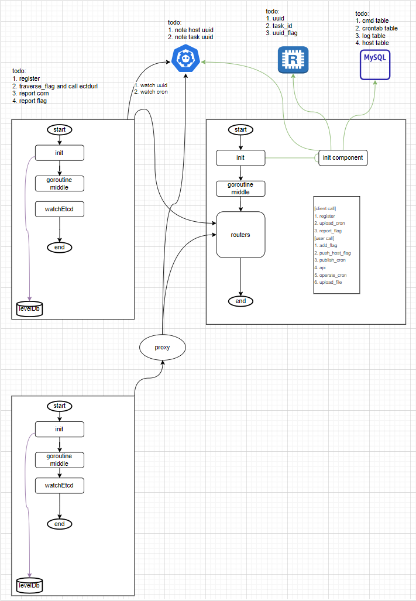

# go-tamapl-server
This is a distributed task management platform，which supports exec command through channel, manage system's crontab task on the website and  distribute own cron.

## Architecture diagram
